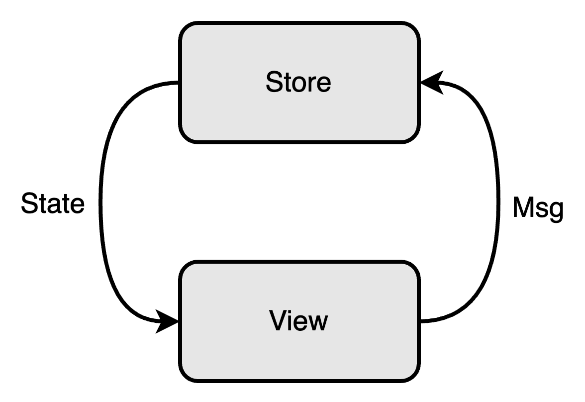
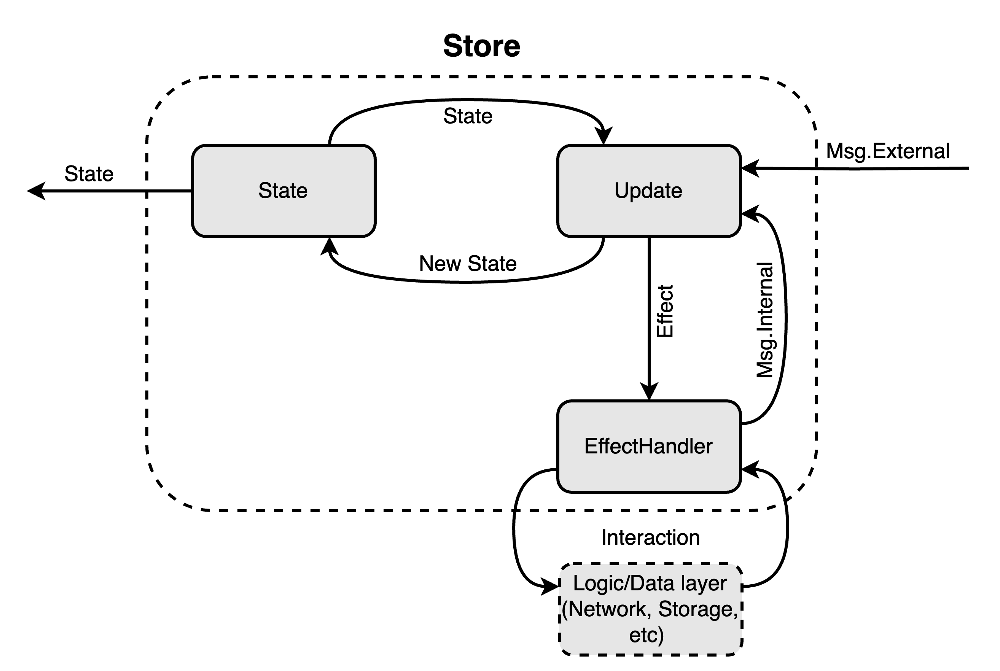
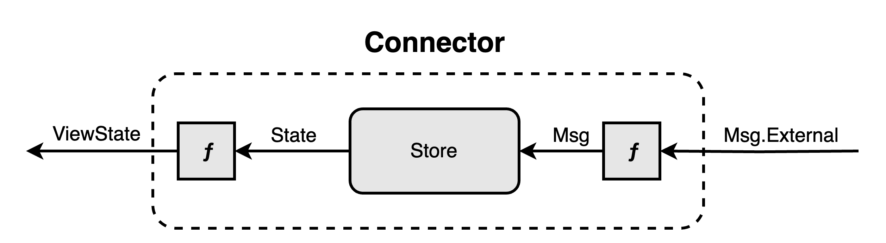
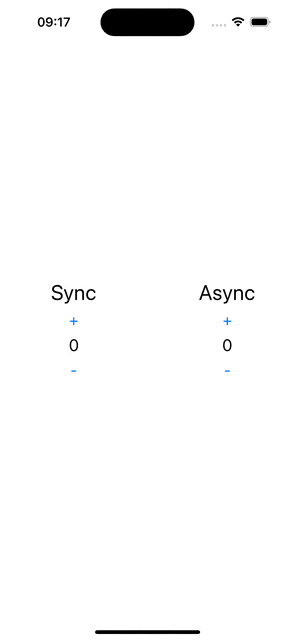

[](https://opensource.org/licenses/Apache-2.0)


# Overview
## What is The Elm Architecture
The Elm Architecture ([Elm Architecture](https://guide.elm-lang.org/architecture/)) is a popular software architecture pattern used in the 
Elm programming language. It provides a structure for development based on functional programming and a unidirectional data flow.


The Elm Architecture consists of three main components:
- `Model` This is the application state that contains all the data needed for its functioning. The model is immutable and is updated only 
through messages (`Msg`).
- `Update` This is a function that takes the current model and a message and returns a new model. It is responsible for handling messages 
and updating the application state.
- `View` This is a function that takes the current model and returns the user interface. The view displays data from the model and reacts 
to user actions by generating new messages.

The Elm Architecture provides a clear separation between the application logic and its presentation, making the code more understandable, 
modular, and easily testable. It also ensures error resilience and prevents many common problems associated with mutable state and side 
effects.



## What is Keemun
Keemun is a Swift framework that provides a way to write code using The Elm Architecture pattern.




# Installation
## CocoaPods
[CocoaPods](http://cocoapods.org/) is a dependency manager for Cocoa projects. You can install it with the following command:

```bash
$ gem install cocoapods
```

To integrate Keemun into your Xcode project using CocoaPods, specify it in your `Podfile`:

```ruby
pod 'Keemun', '2.2.0'
```

Then, run the following command:

```bash
$ pod install
```

## Swift Package Manager

The [Swift Package Manager](https://swift.org/package-manager/) is a tool for automating the distribution of Swift code and is integrated into the `swift` compiler.

Once you have your Swift package set up, adding Keemun as a dependency is as easy as adding it to the `dependencies` value of your `Package.swift`.


```swift
dependencies: [
    .package(url: "https://github.com/pavelannin/Keemun-Swift.git", from: "2.2.0")
]
```


# Componets
## State
`State` is a class that describes the state of your application/feature/screen/view/etc. at a specific moment in time.

## Start
`Start` is the place for initialization. Its method returns the initializing `state` and the initial set of side-effects.

## Msg
Any `Msg` represents an intention to change the state. `Msg` is sent from the user interface/business logic.

## Update
`Update` is the place for logic. Its method takes `state` and `msg` as arguments and returns a new `state` and a collection of `effects`. 
The idea is to be a pure function that modifies the `state` and sends an side-effect according to the received `message` and the current 
`state`.

## Effect
Any `Effect` represents an intention to invoke part of your business logic. `Effect` is sent from the update depending on the received 
message.

## EffectHandler
`EffectHandler` is the place where business logic is executed. It maps an `effect` to an `Operation`, which is either a
`.publisher` (a Combine publisher whose output is fed back into the store) or a `.task` (an async closure that receives
`dispatch`). Every effect is executed independently of the others.

A store can be configured with several handlers, for example one per domain. Each effect is offered to them in the order
they were registered and is executed by the first handler that accepts it, so an effect is never executed twice. Build
such handlers with `init(routing:)` and return `nil` for the effects that belong to somebody else:

```swift
EffectHandler(routing: { effect in
    switch effect {
    case let .loadUser(id):
        return .task { dispatch in
            dispatch(.userWasLoaded(user: await loadUser(id: id)))
        }

    default:
        return nil
    }
})
```

## ViewState
`ViewState` is the projection of `State` that the user interface actually renders. Keeping it separate lets you format
data once (numbers into strings, flags into visibility) and keep SwiftUI views free of logic.

## PairMsg
`PairMsg<ExternalMsg, InternalMsg>` splits messages into those sent by the user interface (`ExternalMsg`) and those sent
by business logic from `EffectHandler` (`InternalMsg`). Use `Update.combine(externalUpdate:internalUpdate:)` to handle
both halves with separate, independently testable `Update` values.

## Connector
`KeemunConnector` is an `ObservableObject` that holds an instance of `Store`, exposes the current `ViewState` through
`@Published`, and forwards `ExternalMsg` from the view into the store.

## StoreParams
`StoreParams` is a container that holds `Start`, `Update`, and `EffectHandler` in one place for creating a `Store`. 
`StoreParams` provides several convenient overridden functions for creating it with optional arguments.

## FeatureParams
`FeatureParams` is a container that holds a `StateTransform` from `State` into `ViewState` and a function that maps
`ExternalMsg` into `Msg`. When `State == ViewState` and/or `Msg == ExternalMsg`, shorter initializers are available.

## KeemunFeature
`KeemunFeature` is the protocol that ties everything together: it exposes `storeParams` and `featureParams`, so a
connector can be created from a feature with a single call.

# Example
A feature is a single `struct` conforming to `KeemunFeature`, split across extensions in separate files. The example below
is the counter from the sample project: the synchronous counter is changed in `Update`, the asynchronous one goes through
an `Effect`.

## Declaring the feature and its StoreParams

```swift
import Keemun

struct CounterFeature: KeemunFeature {
    typealias Msg = PairMsg<ExternalMsg, InternalMsg>

    var storeParams: StoreParams<State, Msg, Effect> {
        StoreParams(
            start: Start { .next(.init()) },
            update: .combine(
                externalUpdate: Self.externalUpdate,
                internalUpdate: Self.internalUpdate
            ),
            effectHandler: Self.effectHandler()
        )
    }
}

extension CounterFeature {
    struct State {
        var syncCount: Int = 0
        var asyncCount: Int = 0
        var isAsyncRunning: Bool = false
    }
}
```

## Writing Update

`externalUpdate` handles messages coming from the user interface, `internalUpdate` handles messages produced by business
logic. Both are pure functions, so they can be tested by calling `run` directly.

```swift
extension CounterFeature {
    static let externalUpdate = Update<State, ExternalMsg, Effect> { msg, state in
        switch msg {
        case .incrementSync:
            return .next(state) { $0.syncCount = $0.syncCount + 1 }

        case .decrementSync:
            return .next(state) { $0.syncCount = $0.syncCount - 1 }

        case .incrementAsync:
            return .next(state) { state, effects in
                guard !state.isAsyncRunning else { return }
                state.isAsyncRunning = true
                effects.append(.increment(state.asyncCount))
            }

        case .decrementAsync:
            return .next(state) { state, effects in
                guard !state.isAsyncRunning else { return }
                state.isAsyncRunning = true
                effects.append(.decrement(state.asyncCount))
            }
        }
    }

    static let internalUpdate = Update<State, InternalMsg, Effect> { msg, state in
        switch msg {
        case .completedAsyncOperation(let newValue):
            return .next(state) {
                $0.asyncCount = newValue
                $0.isAsyncRunning = false
            }
        }
    }

    enum ExternalMsg {
        case incrementSync
        case decrementSync
        case incrementAsync
        case decrementAsync
    }

    enum InternalMsg {
        case completedAsyncOperation(Int)
    }
}
```

## Writing EffectHandler

```swift
extension CounterFeature {
    static func effectHandler() -> EffectHandler<Effect, InternalMsg> {
        EffectHandler { effect in
            switch effect {
            case .increment(let value):
                return .task { dispatch in
                    try? await Task.sleep(for: .seconds(1))
                    dispatch(.completedAsyncOperation(value + 1))
                }

            case .decrement(let value):
                return .task { dispatch in
                    try? await Task.sleep(for: .seconds(1))
                    dispatch(.completedAsyncOperation(value - 1))
                }
            }
        }
    }

    enum Effect {
        case increment(Int)
        case decrement(Int)
    }
}
```

## Creating FeatureParams

`viewStateTransform` prepares the data for rendering, `messageTransform` lifts `ExternalMsg` into the feature `Msg`.

```swift
extension CounterFeature {
    var featureParams: FeatureParams<State, Msg, ViewState, ExternalMsg> {
        FeatureParams(
            viewStateTransform: StateTransform { state in
                ViewState(
                    syncCount: String(state.syncCount),
                    asyncCount: String(state.asyncCount),
                    isAsyncRunning: state.isAsyncRunning
                )
            },
            messageTransform: Msg.up
        )
    }

    struct ViewState {
        let syncCount: String
        let asyncCount: String
        let isAsyncRunning: Bool
    }
}
```

## Usage in UI layer

The public view owns the connector, while the private `MainView` receives only plain data and closures, which keeps it
easy to preview.

```swift
struct CounterFeatureView: View {
    @ObservedObject private var connector: KeemunConnector<CounterFeature.ViewState, CounterFeature.ExternalMsg>

    init(_ connector: KeemunConnector<CounterFeature.ViewState, CounterFeature.ExternalMsg>) {
        self.connector = connector
    }

    var body: some View {
        MainView(
            state: connector.state,
            syncIncrementAction: { connector.dispatch(.incrementSync) },
            syncDecrementAction: { connector.dispatch(.decrementSync) },
            asyncIncrementAction: { connector.dispatch(.incrementAsync) },
            asyncDecrementAction: { connector.dispatch(.decrementAsync) }
        )
    }
}

private struct MainView: View {...}
```

## Creating a connector instance

```swift
let connector = KeemunConnector(CounterFeature())
CounterFeatureView(connector)
```

# Xcode templates
The repository ships file templates that generate the whole file layout of a feature. Install them with:

```bash
$ make install_templates
```

After restarting Xcode the templates appear in `File > New > File` under `Keemun Templates`. Their names combine three
options:

- `Single` / `Multi` — keep `Update` and `EffectHandler` in one file, or split them into separate ones.
- `Unified` / `Distributed` — use a single `Msg` type, or split it into `ExternalMsg` and `InternalMsg` via `PairMsg`.
- `HasInputEvent` / `HasOutputEvent` — add plumbing for receiving events from the outside world and for sending events out.

Run `make uninstall_templates` to remove them.

# Sample project
The sample project is a screen with two counters: synchronous and asynchronous. The synchronous counter is modified in `Update`, 
demonstrating state changes, while the asynchronous counter is modified in `EffectHandler`, simulating asynchronous business logic. 

## Screenshots
